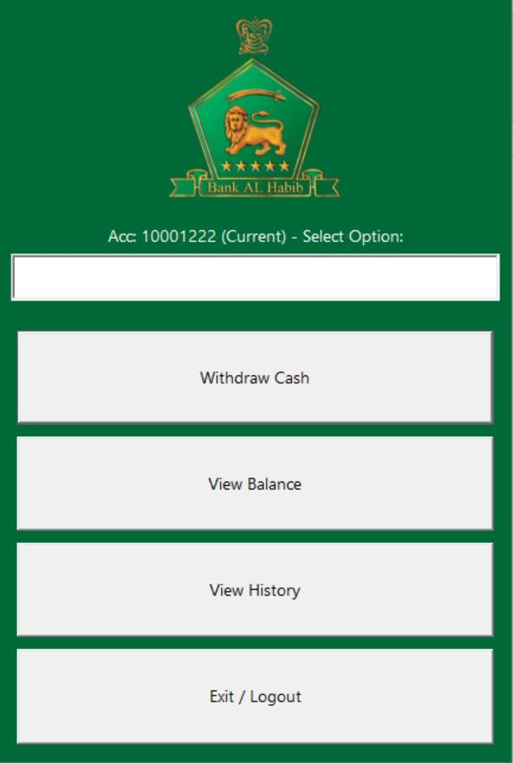
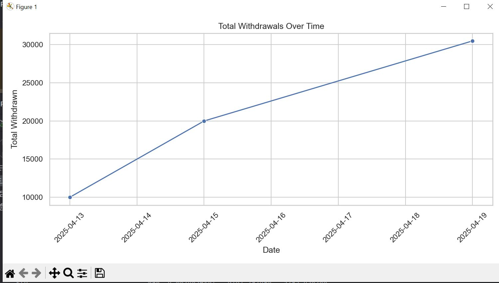
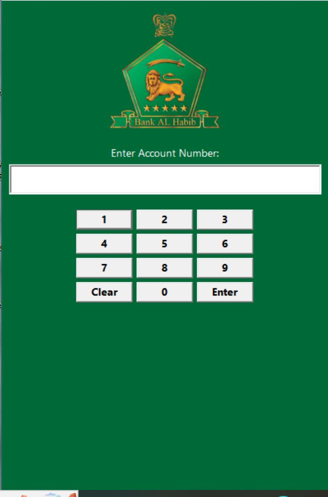
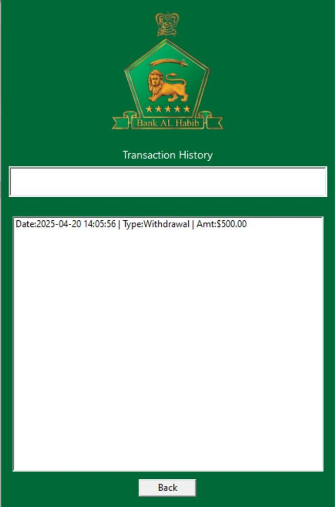

# ATM Simulation - Project Report

## Group Members

Ali Hussain -- 24K-0578\
Huzaifa Shahid -- 24K-0860\
Ammar Mufti -- 24K-0586

## Submission Date

20/04/2025

## 1. Executive Summary

This project is a real-life simulation of an ATM system developed using
Object-Oriented Programming (OOP) principles in C++. It features a
user-friendly graphical interface built with wxWidgets, making it an
ideal choice for beginner-friendly GUI development.

The system allows users to perform essential banking operations such as
login, PIN verification, cash withdrawal, and transaction history
viewing. All user transactions are recorded and stored in a CSV file,
ensuring traceability and data persistence.

To extend the functionality beyond C++, a Python script is integrated to
perform data analysis and visualization on the recorded transactions
using Pandas, Matplotlib, and Seaborn. This provides insights into user
behavior and transaction trends.

The overall structure is inspired by real-world banking systems,
particularly Bank Al Habib, and reflects a simplified version of how
modern ATMs operate. This project not only demonstrates practical
application of OOP but also shows how C++ and Python can be combined to
build powerful and insightful software systems.

## 2. Introduction

The purpose behind creating this project was to practically implement
the concepts taught in our course by applying them to a real-world
application. As data science continues to grow rapidly, we decided to
enhance our system by integrating data analysis capabilities.

For this, we chose Python, a language widely recognized for its powerful
and beginner-friendly tools in the field of data science. By
incorporating Python for analytics and C++ for core system logic and
GUI, we aimed to demonstrate the use of multi-language integration,
which not only makes the system more professional and scalable but also
reflects how modern software systems are developed in the industry.

This project allowed us to bridge the gap between theory and practical
use while also exploring how traditional programming (C++) can work
hand-in-hand with data-driven approaches (Python) to create
comprehensive and intelligent applications.

## 3. Project Description

The project encompasses the following key components and
functionalities, combining C++ and Python to simulate a real-life ATM
system with data analytics support:

● Graphical User Interface (GUI)

A user-friendly and interactive ATM interface developed using wxWidgets
in C++. It features a numeric keypad, input fields, and screen
transitions, closely giving the experience of actual ATM.

● Object-Oriented Design

The system is fully developed using Object-Oriented Programming
principles. It makes use of classes, inheritance, constructor chaining,
polymorphism, and operator overloading, providing a strong foundation
and using our course learnings. Some things like operator overloading
was not necessary in our system but we included it by setting it default
to show learnings.

● Input Handling & Validation

The application effectively handles user input for Account Number and
PIN, with validation logic ensuring that entries conform to required
formats and lengths. Limits are set for each input like Account number,
Pin, and Amount. We used try and catch to make effective error handling
in our system. This helps simulate a secure and responsive ATM
environment.

● Data Analysis with Python

All transactions performed within the ATM simulation are stored in a CSV
file. A Python script is used to analyze this data using libraries such
as Pandas (for data manipulation), Matplotlib, and Seaborn (for data
visualization). The analysis shows us transaction trends and overall
summary of all the transactions that were stored in the file.

This integration of C++ for system operations and Python for data
analysis shows a multi-language development approach, similar to
real-world banking systems where different technologies collaborate to
deliver a engaging user experience.

• Technical Overview:

Tools:

\- C++ (Visual Studio, VS Code)

-wxWidgets for GUI

\- Python (pandas, matplotlib, seaborn) for data visualization.

## 4. Methodology

Our project was developed over the span of five weeks, following a
structured and collaborative approach:

● Week 1: System Design and Planning

In the first week, our team focused on identifying the required classes
and relationships for the ATM system. We designed a UML diagram to
visualize the system structure and clarify object interactions, ensuring
a solid foundation before jumping into code.

● Week 2: Core Implementation in C++

During the second week, we began implementing the identified classes in
C++, along with their respective constructors, methods, and inheritance
structures. This stage focused entirely on applying OOP concepts taught
in class.

● Week 3 & 4: GUI Development with wxWidgets

Once the core logic was complete, Huzaifa Shahid and Ali Hussain
initiated the development of the Graphical User Interface (GUI) using
wxWidgets. As it was our first time working with GUI libraries, we
referred to online tutorials and took assistance from ChatGPT to better
understand the components and integrate them with our C++ logic.

● Week 5: Data Analysis Integration with Python

After finalizing the ATM simulation, Ammar and Ali Hussain worked on the
data analysis module using Python. We explored essential libraries such
as Pandas for data manipulation, Matplotlib, and Seaborn for
visualizations. This phase allowed us to extract meaningful insights
from transaction data stored in a CSV file.

• Roles and Responsibilities:

UML was designed by all the three members collectively. Ali Hussain and
Huzaifa Shahid designed GUI using WX widgets by taking help from youtube
and GCR uploaded videos, and Chatgpt. Lastly, Ali Hussain and Muhammad
Ammar added data analysis with the help of Python using the following
libraries: matplot and sea born for visuals and graphs and pandas for
data analysis.

## 5. Project Implementation

The ATM simulation system was developed using C++ and enhanced with a
Python-based data analysis module. Below are the key components and
implementation details:

● GUI Design:

A keypad-based interface was developed using wxWidgets, simulating a
real-world ATM where users can input their account number and PIN. The
interface is user-friendly and intuitive, making it suitable for
beginners interacting with GUI systems.

● Object-Oriented Class Structure:

The system is built using Object-Oriented Programming (OOP) principles.
Key features include:

-   Abstraction & Encapsulation for managing account and transaction
    > data

-   Inheritance & Polymorphism for flexible code structure

-   Constructor & Operator Overloading to enhance usability and
    > streamline data handling

-   These principles were applied across classes managing user data,
    > backend logic, and UI behavior.

● Data Analysis Module:

A separate Python module was created to analyze ATM transaction data
saved in a CSV file for which we used:

-   Pandas for data manipulation

-   Matplotlib and Seaborn for creating visuals like graph

This module provided insights into user activity, transaction frequency,
and overall system usage patterns.

● Primary Functionalities:

-   Accept numeric input from the GUI

-   Display entered digits in real-time

-   Allow users to clear and submit account details

-   Validate user credentials

-   Handle button click events using OOP-driven event handling

● Challenges Faced:

-   One of the major challenges was our lack of experience with GUI
    > development. Integrating the wxWidgets library with our existing
    > C++ logic required time to understand event handling.

-   We also faced compiler issues---the code ran fine on our desktop
    > using VS Code, but failed on laptops due to environment
    > differences. Ali Hussain solved this by using ucrt64 commands and
    > manually creating an .exe file to ensure compatibility.

-   However, the biggest challenge was linking the OOP-based backend
    > with the GUI layer. Bridging the two in a seamless manner made us
    > learn how real world applications are made.

## 

## 6. Results

• Project Outcomes:

The system allows secure login, withdrawal, and transaction logging.
Data analysis graphs were successfully generated using the integrated
Python script.

• Screenshots and Illustrations:

Screenshots of GUI, transaction interface:

{width="3.4213626421697287in"
height="5.078125546806649in"}

Data Analysis using Python:

{width="6.0in" height="3.263888888888889in"}

{width="6.0in" height="3.4027777777777777in"}

{width="6.0in" height="3.9444444444444446in"}

• Testing and Validation:

Tested on multiple systems and accounts to ensure accuracy of
transactions and logs.

{width="3.752285651793526in"
height="5.684712379702537in"}

{width="4.072916666666667in"
height="5.869792213473316in"}

{width="4.15625in" height="5.828125546806649in"}

## 

## 

## 

## 

## 7. Conclusion

This project served as a comprehensive learning experience in applying
Object-Oriented Programming (OOP) principles with GUI and data analysis.
It provided exposure to integrating multiple components---C++ logic, a
user-friendly interface, and Python-based analysis---to simulate a
realistic ATM system.

The challenges faced, especially in linking the GUI with OOP structures
and handling different development environments, significantly enhanced
our problem-solving skills and technical adaptability.

Data analysis module using Python allowed us to gain learnings into data
science and how data is managed. Transaction patterns were identified
and displayed. Overall, the project allowed us to make a real world
application and grasp the learnings of gui and data science which were
completely new for us. We also learnt how classes and objects are used
in systems to make it manageable and clear. Looking forward for making
more projects ahead using concepts of OOP.
