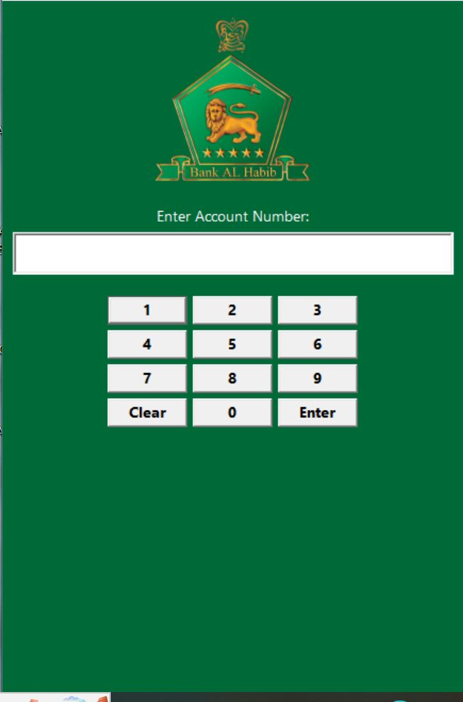
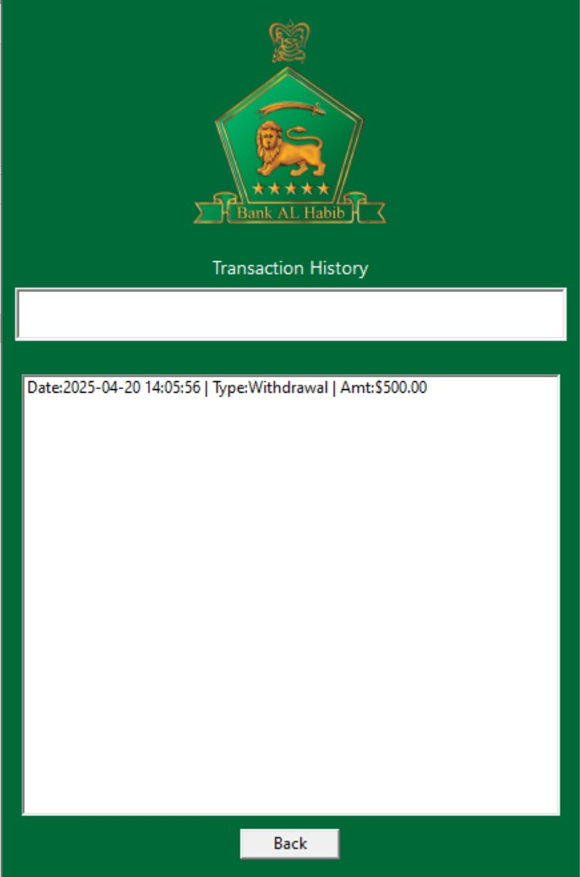
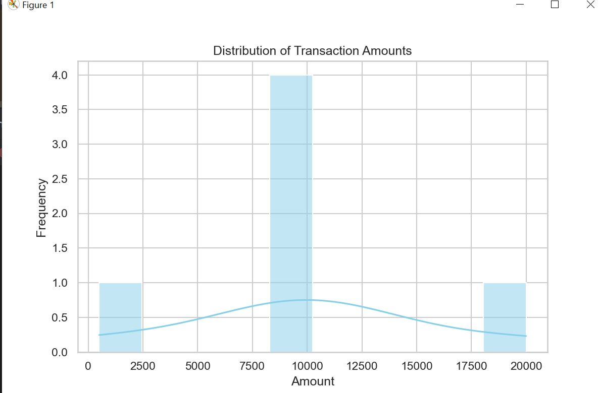
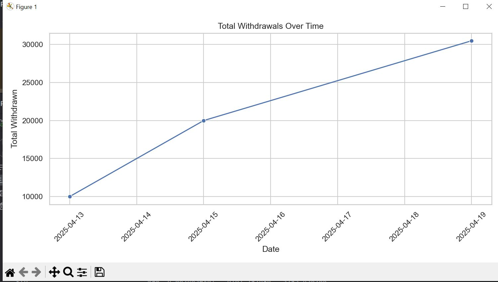
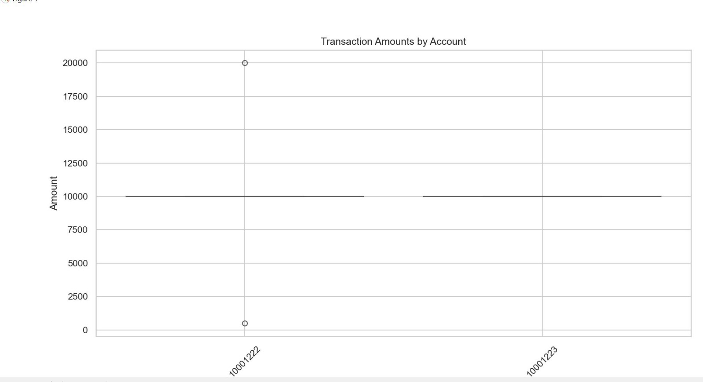
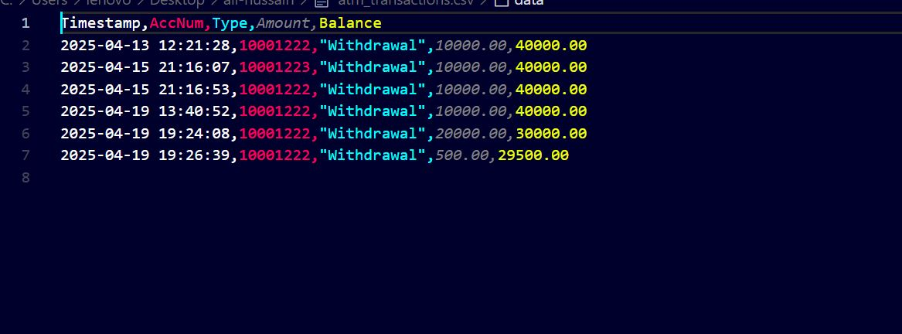
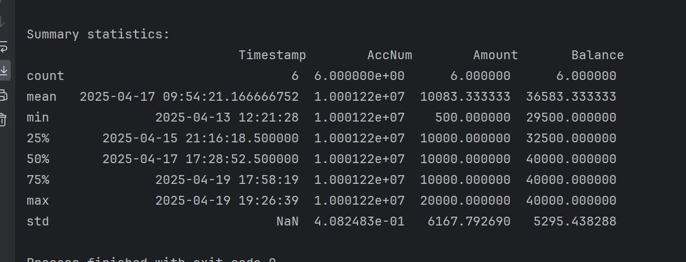

**ATM Simulation (OOP-Lab Project)**

**Group Members:**

Ali Hussain 24K-0578

Huzaifa Shahid 24K-0860

Ammar Mufti 24K-0586

**Date of Submission:** 20/04/2025

**Executive Summary**

The project ATM Simulation is the combination of *[C++ code based on OOP
principles]{.underline}*, *[Graphical User Interface (GUI)]{.underline}*
and *[AI-based analysis]{.underline}*. The project demonstrates the use
of OOP principles including encapsulation, abstraction, class design and
inheritance. Moreover, it includes user-friendly interfaces and smart
decision-making using data analysis technique. The system includes a
simulated ATM interface (Like one of Bank Al-Habib) and utilizes data
driven methods that enhance user interaction.

**Introduction**

This project introduces OOP principles through a GUI that simulates an
ATM environment where users input data (Account numbers and PIN) through
a keypad. It also explores Data analysis features to interpret and act
on the data intelligently.

**Project Description**

The project encompasses the following components and functionalities:

-   **Graphical User Interface (GUI)\
    **A simulated ATM interface featuring a numeric keypad allowing
    users to enter their account number and PIN in a user-friendly
    environment developed using WX Widgets.

-   **Object-Oriented Design\
    **The entire C++ code is built around OOP principles such as
    classes, inheritance, constructor chaining, polymorphism, and
    operator overloading.

-   **Input Handling & Validation\
    **The system takes input via numeric keyboard (Account number and
    PIN) and verifies the PIN by checking the PIN of the account number
    in the file.

-   **AI-Based Logic Module\
    **A basic data analysis technique using python that analyses the
    user's input and handle the user data more efficiently and
    intelligently. It was implemented via Python files consisting of 3
    libraries mathplot and sea born for visuals and graphs, and pandas
    for data analysis.

> The project was developed using the following tools:

1.  **VS Code:**

> Used for the writing, debugging, and compiling C++ code

2.  **Visual Studio 2022:**

> Used for writing, debugging, and compiling the C++ code, especially
> for GUI design with WX Widgets.

3.  **Pycharm:\
    **Used for writing, debugging, and compiling Python code (for data
    analysis)

**Methodology**

-   **First Week:**

We designed the UML design for the entire project.

-   **Second Week:**

We designed the classes and their functions. This basically included the
entire C++ code based on OOP principles

-   **Third and Fourth Week:**

Huzaifa Shahid and Ali Hussain designed the GUI. Since it was completely
new for us, the help was taken from Youtube, ChatGPT and some seniors.

-   **Fifth Week:**

Ammar Mufti and Ali Hussain added data analysis by including filing and
integrating our system with python file.

**Project Implementation**

The system is developed in C++ with the following features:

-   **GUI Design**: A keypad-based interface mimicking an ATM for
    entering an account number and PIN. It was developed using WX
    Widgets.

-   **Class Structure**: Classes handle user data and possesses some key
    functions and attributes. It includes fundamental features of OOP
    including abstraction, polymorphism, constructor overloading,
    operator overloading and inheritance. The main class is Bank Account
    and Transactions. There are derived classes Savings and Current
    Account to show the concept of inheritance. Moreover, we created a
    user class for further extension but it is currently not used in an
    atm because the objects are created of BankAccounts.

-   **AI Module**: Simulated behaviour based on input data, such as
    checking for valid patterns, account verification simulations, or
    basic rule-based alerts. Data analysis was implemented via Python
    files. Consisting of 3 libraries mathplot and sea born for visuals
    and graphs, and pandas for data analysis.

-   **Primary Functions**: Accept numeric input from GUI buttons,
    Display entered digits in real-time, Clear and submit account
    number, Validate input using basic AI rules, Trigger logic through
    event handling in an OOP-structured manner

-   **Challenges:** One of the major challenges was that it was our
    first time working with GUI development, so understanding how
    everything worked took some time. We all developed the code in turns
    so when Huzaifa made changes from his PC using VS code, Ammar's
    laptop could not run it showing that its missing DLL files. As a
    result, Ammar had to run the project manually using ucrt64 commands,
    which involved creating a separate folder on the desktop and
    executing it from there.

> In terms of data analysis, the challenges were not significant since
> Ali and Huzaifa already had prior knowledge of Python. The main task
> was identifying which libraries to use for performing Exploratory Data
> Analysis (EDA) on our system.
>
> However, the biggest challenge of all was linking the OOP-based C++
> code with the GUI. Integrating both components in a seamless way
> required a deep understanding of both programming logic and interface
> interaction**.**

**Results**

-   The GUI successfully accepts numeric input

-   The system handles input events using class methods

-   The AI component performs basic data analysis, such as validating
    inputs or simulating transaction checks

-   Enhances usability and provides a realistic simulation of an ATM

**User Interface using GUI**

> {width="4.529861111111111in"
> height="6.858333333333333in"}
>
> {width="6.268055555555556in"
> height="9.315972222222221in"}
>
> **Transaction History**
>
> {width="6.268055555555556in"
> height="9.17458552055993in"}
>
> **Account Balance**
>
> {width="6.268007436570429in"
> height="9.197129265091863in"}
>
> **Integration using Python Graphs**
>
> {width="6.268055555555556in"
> height="4.122222222222222in"}
>
> {width="6.268055555555556in"
> height="3.55625in"}
>
> {width="6.268055555555556in"
> height="3.404861111111111in"}
>
> **History**
>
> {width="6.268055555555556in"
> height="2.3201388888888888in"}
>
> **Summary Statistics**
>
> {width="6.268055555555556in"
> height="2.397222222222222in"}
>
> **Testing:** We ran the project multiple times using different
> accounts and checked the outputs. I also asked GPT what could be
> improved in this. There were several issues in the user interface,
> which we identified and improved by repeatedly testing and refining
> the design.
>
> **Conclusion**
>
> This project served as a comprehensive learning experience in applying
> Object-Oriented Programming principles alongside GUI development and
> data analysis technique. It provided valuable exposure to integrating
> different components to simulate a realistic ATM system. The
> challenges faced, especially in linking GUI with OOP and managing
> different development environments, enhanced our problem-solving
> skills.
>
> Repeated testing and interaction with AI tools such as GPT helped
> refine the interface and logic. Overall, the project not only
> strengthened technical skills but also emphasized the importance of
> iterative development, debugging, and user-friendly design.
